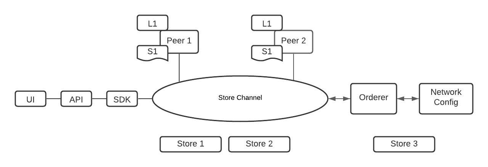

# Secured App Distribution With HyperLedger Fabric:

## Components:
	
* Backend code - JavaScript with ExpressJS to provide REST API
* Network - Hyperledger Fabric
* Chaincode - JavaScript

## Users in this Application :

* App Developer
* App User

## Application Architecture :

## Application Details :

* Users (developer/app user) are enrolled into the application by an Admin.
* Developer can register APP
* Developer can edit APP details
* User can check APP
* User can submit and read reviews for an APP 

## Fabric Network details :

* Two Orgs/Store (Store 3 can be added latter to the network)
* One peer for each Org/Store
* One Channel 

## Three Smart Contracts :

* primary-contract 
* developer-contract
* user-contract

## primary-contract

* initLedger 

## developer-contract

* registerApp
* updateAppDetails

## user-contract

* appExists
* giveReviews
* giveRatings
* readReviews
* readRatings